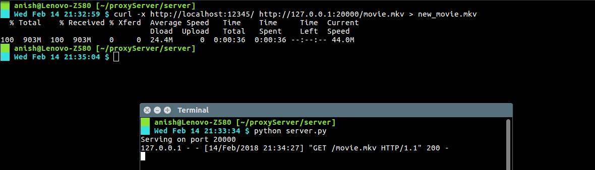
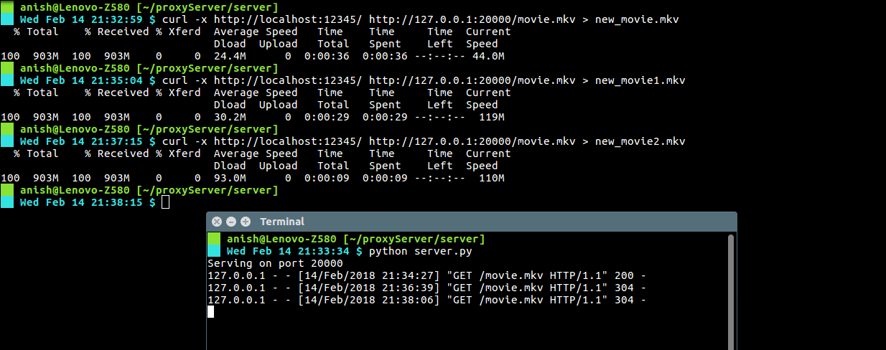
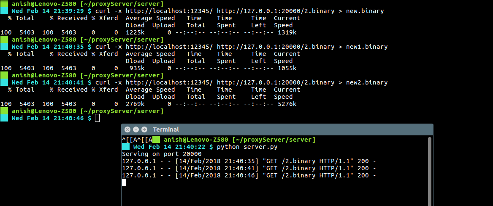

# Proxy Server

**Prathyakshun Rajashankar 20161107**

**Anish Gulati                         20161213**

```bash
# To run the server
cd path/to/repo/server
python server.py	
# To run the proxy server
cd path/to/repo
python proxy.py
```

This sets up the server and the proxy server running.

Requests can be sent from the client side from browser or via a curl request.

If the request is sent via the browser then proxy settings for the browser need to be updated to **localhost** and **port number**: 12345

Generally, when the **client** (browser or curl command) makes a request, the request is sent to the **web server**. The web server then processes the request and sends back a response message to the requesting client.

In order to improve the performance we create a proxy server between the client and the webserver. 
A **web proxy** is a program that acts as an intermediary between a web client (browser or curl) and a web server.

### Process:

The client requests the objects via the proxy server. The proxy server will forward the client’s request to the web server. 
The web server will then generate a response message and deliver it to the proxy server, which in turn sends it to the client.

Sample request via curl request is shown below

```bash
curl -x http://localhost:12345 http://127.0.0.1:20000/1.txt
# here the server is running on port 20000
# The proxy's port is 12345
```

### Features:

**Caching:** The proxy server has a caching capacity of 3. When a requested file is present in the cache then a conditional request is sent to the server where If-Modified-Since header is added with the time when the file was stored in the  proxy server. If the time is less than the time the file modified in the main server, the server responds with **200**  message where the entire file will be sent by the server to the proxy server which in turn will send it to the client. If otherwise, **304** request will be sent from the server and the file cached in the proxy server will be sent to the  client.

**NOTE:** Caching will not happen if the server response had Cache-Control header with no-cache.

If file is not found then 404 file not found will be sent. 

All error scenarios are handled.

Multiple clients can send requests at once via the proxy server as the client requests are handled through threads.

**Time taken when file is not cached**



**Average time taken when file is cached**



**Cache Control**

